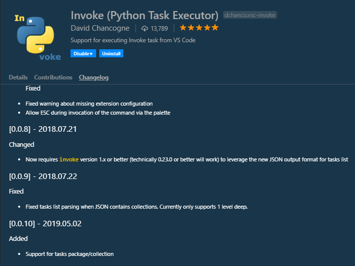
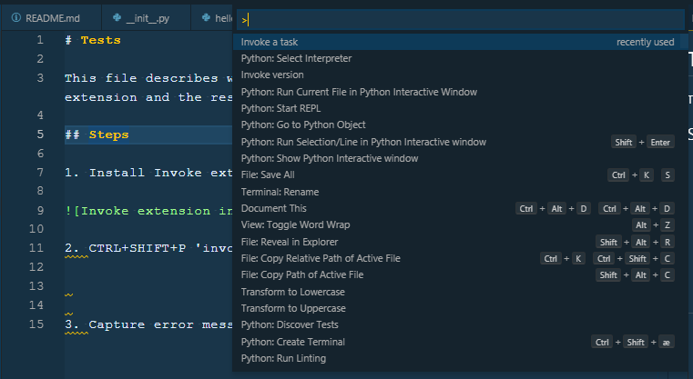
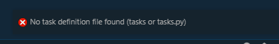
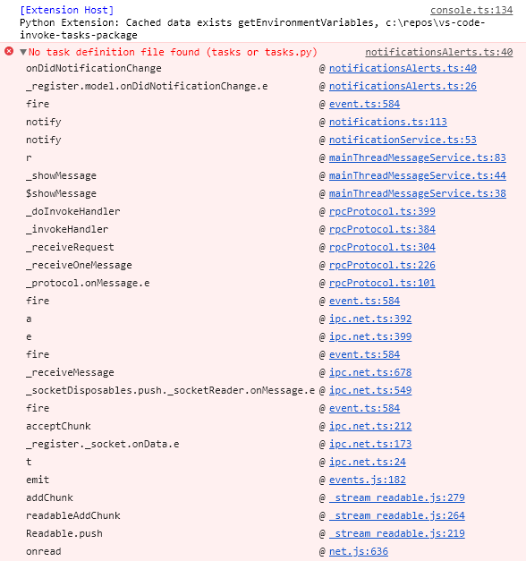
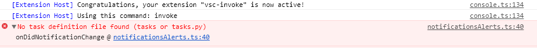
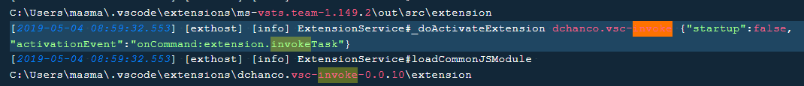
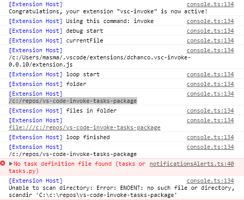
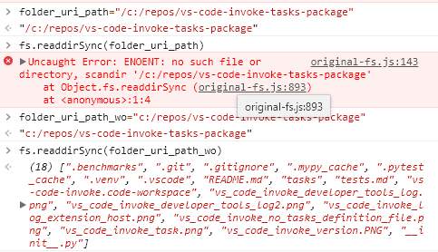
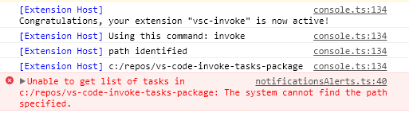
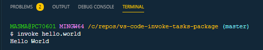

# Tests

This file describes what I've done to test the vs code Invoke extension and the results

## Steps

- Install Invoke extension v. 0.10



- CTRL+SHIFT+P 'invoke a task'



- Capture error messages



- Find more information in Developer Tools log





- Find more information in Log(Extension Host)



## Next Steps

- I think the text 'No task definition file found (tasks or tasks.py)' could be improved if changed to 'No tasks module (tasks.py) or package (/tasks) found'

- I would have like to debug the extension.js then it would have been easy to see what goes wrong. But i'm not able to do this. Even after googling how to debug installed vs code extensions.

- But i can insert old school "console.log" into the extension

## Debugging using console.log

I inserted the console.log statements in the code below and also some code to list what is in the folder.uri.path folder.

```javascript
let callTask = vscode.commands.registerCommand('extension.invokeTask', function () {

      if (!vscode.workspace.workspaceFolders) {
         vscode.window.showErrorMessage('No Project/Workspace opened');
         return;
      }

      // Current file open to help find active workspace
      var currentFile;
      // Default to first workspace in case we don't have an open file or
      // can't find a tasks.py file
      var path = vscode.workspace.workspaceFolders[0].uri.path;
      // Determine path to currently open and active file
      if (vscode.window.activeTextEditor) {
         currentFile = vscode.window.activeTextEditor.document.uri.path;
      }
      // For each workspace see if folder matches path of currently open
      // file, i.e. are we in the active workspace
      console.log("debug start")
      console.log("currentFile")
      console.log(currentFile)
      console.log("loop start")
      vscode.workspace.workspaceFolders.forEach((folder, index) => {
         console.log("folder")
         console.log(folder.uri.path)
         console.log("files in folder")
         const path = "file://" + folder.uri.path;
         console.log(path)
         fs.readdir(folder.uri.path, function (err, files) {
            //handling error
            if (err) {
               return console.log('Unable to scan directory: ' + err);
            }
            //listing all files using forEach
            files.forEach(function (file) {
               // Do whatever you want to do with the file
               console.log(file);
            });
         });

         if (currentFile && currentFile.startsWith(folder.uri.path)) {
            console.log("currentFile startsWith is true")
            // Is there a tasks.py at the root of the active workspace?
            if (fs.existsSync(`${folder.uri.path}/tasks.py`) || fs.existsSync(`${folder.uri.path}/tasks`)) {
               // Use active workspace path
               path = folder.uri.path
               console.log("path set from currentFile startsWith")
               console.log(path)
            }

         }
         // Otherwise grab with workspace with a tasks.py file
         else {
            if (fs.existsSync(`${folder.uri.path}/tasks.py`) || fs.existsSync(`${folder.uri.path}/tasks`)) {
               // Use active workspace path
               path = folder.uri.path
               console.log("path set from not currentFile startsWith")
               console.log("path set")
               console.log(path)
            }
         }
      });
      console.log("loop finished")
      console.log(path)
      if (fs.existsSync(`${path}/tasks.py`)) {
         vscode.window.showInformationMessage("Using task definitions: " + path + "/tasks.py");
      }
      if (fs.existsSync(`${path}/tasks`)) {
         vscode.window.showInformationMessage("Using tasks package definitions: " + path + "/tasks");
      }
      if (!fs.existsSync(`${path}/tasks.py`) && !fs.existsSync(`${path}/tasks`)) {
         vscode.window.showErrorMessage('No task definition file found (tasks or tasks.py)');
         return;
      }
```

and saw



The important part here is that

folder.url.path = "/c:/repos/vs-code-invoke-tasks-package" and that this path is somehow not valid.

## Ahh

I had a feeling this could be an issue related to the folder.url.path string not being "valid" on Windows. So i tried some things in the debugger and found a



## First Problem Solved

If i replace the forEach code with the below

```javascript
vscode.workspace.workspaceFolders.forEach((folder, index) => {
   const validWindowsPath = folder.uri.path.slice(1);

   if (currentFile && currentFile.startsWith(validWindowsPath)) {
      // Is there a tasks.py at the root of the active workspace?
      if (fs.existsSync(`${validWindowsPath}/tasks.py`) || fs.existsSync(`${validWindowsPath}/tasks`)) {
         // Use active workspace path
         path = validWindowsPath
      }

   }
   // Otherwise grab with workspace with a tasks.py file
   else {
      if (fs.existsSync(`${validWindowsPath}/tasks.py`) || fs.existsSync(`${validWindowsPath}/tasks`)) {
         // Use active workspace path
         path = validWindowsPath
      }
   }
});
console.log("path identified");
console.log(path);
```

The the loop finds a path



## Then we have a second Problem

As you can see above there is still a problem

## Second problem Solved

If i replace ```;``` with ```&&```

```javascript
exec(`cd ${path} && ${invokeCmd} --list --list-format=json`, function (err, stdOut, stdErr) {
```

Then everything works perfect.



## The code that works for messages

The full code that works for me is

```javascript
// The module 'vscode' contains the VS Code extensibility API
// Import the module and reference it with the alias vscode in your code below
const vscode = require('vscode');
const exec = require('child_process').exec;
const fs = require('fs');

// this method is called when your extension is activated
// your extension is activated the very first time the command is executed
function activate(context) {

   // Use the console to output diagnostic information (console.log) and errors (console.error)
   // This line of code will only be executed once when your extension is activated
   console.log('Congratulations, your extension "vsc-invoke" is now active!');

   //var c = vscode.workspace.getConfiguration();
   //if ( c.has('vsc-invoke.invoke.paaaath') ) {
   //  console.log('Found section')
   //}

   // Look config for 'vsc-invoke.invoke.path' that defines custom path to invoke command
   let invokeCmd = 'invoke';
   let c = vscode.workspace.getConfiguration();
   if (c.has('vsc-invoke.invoke.cmd')) {
      invokeCmd = c.get('vsc-invoke.invoke.cmd');
   }
   //let invokeExecPath = vscode.workspace.getConfiguration('vsc-invoke').get('invoke.path');
   //let invokeCmd = invokeExecPath ? invokeExecPath+"invoke" : 'invoke';
   console.log('Using this command: ' + invokeCmd);

   // The command has been defined in the package.json file
   // Now provide the implementation of the command with  registerCommand
   // The commandId parameter must match the command field in package.json
   let showVersion = vscode.commands.registerCommand('extension.invokeVersion', function () {
      exec(invokeCmd + ' -V', function (err, stdOut, stdErr) {
         if (err) {
            vscode.window.showInformationMessage(stdErr);
         }
         else {
            vscode.window.showInformationMessage(stdOut);
         }
      });
   });

   let callTask = vscode.commands.registerCommand('extension.invokeTask', function () {

      if (!vscode.workspace.workspaceFolders) {
         vscode.window.showErrorMessage('No Project/Workspace opened');
         return;
      }

      // Current file open to help find active workspace
      var currentFile;
      // Default to first workspace in case we don't have an open file or
      // can't find a tasks.py file
      var path = vscode.workspace.workspaceFolders[0].uri.path;
      // Determine path to currently open and active file
      if (vscode.window.activeTextEditor) {
         currentFile = vscode.window.activeTextEditor.document.uri.path;
      }
      // For each workspace see if folder matches path of currently open
      // file, i.e. are we in the active workspace
      vscode.workspace.workspaceFolders.forEach((folder, index) => {
         const validWindowsPath = folder.uri.path.slice(1);

         if (currentFile && currentFile.startsWith(validWindowsPath)) {
            // Is there a tasks.py at the root of the active workspace?
            if (fs.existsSync(`${validWindowsPath}/tasks.py`) || fs.existsSync(`${validWindowsPath}/tasks`)) {
               // Use active workspace path
               path = validWindowsPath
            }

         }
         // Otherwise grab with workspace with a tasks.py file
         else {
            if (fs.existsSync(`${validWindowsPath}/tasks.py`) || fs.existsSync(`${validWindowsPath}/tasks`)) {
               // Use active workspace path
               path = validWindowsPath
            }
         }
      });
      console.log("path identified");
      console.log(path);
      if (fs.existsSync(`${path}/tasks.py`)) {
         vscode.window.showInformationMessage("Using task definitions: " + path + "/tasks.py");
      }
      if (fs.existsSync(`${path}/tasks`)) {
         vscode.window.showInformationMessage("Using tasks package definitions: " + path + "/tasks");
      }
      if (!fs.existsSync(`${path}/tasks.py`) && !fs.existsSync(`${path}/tasks`)) {
         vscode.window.showErrorMessage('No task definition file found (tasks or tasks.py)');
         return;
      }
      // Get list of tasks. --list-format returns JSON
      exec(`cd ${path} && ${invokeCmd} --list --list-format=json`, function (err, stdOut, stdErr) {
         if (err) {
            vscode.window.showErrorMessage(`Unable to get list of tasks in ${path}: ${stdErr}`);
            return;
         }
         // Parse JSON result
         // Get tasks that are part of collections. This will only go 1 level deep.
         // For each collection maps tasks' name. Final reduce is to flatten returned aray
         var collections = JSON.parse(stdOut).collections
            .map(c => c.tasks.map(t => c.name + '.' + t.name))
            .reduce((prev, cur) => prev.concat(cur), []);
         // Get simple tasks and add tasks from collections from above
         var tasks = JSON.parse(stdOut).tasks.map(e => e.name).concat(collections);
         var lastArgs = '';
         vscode.window.showQuickPick(tasks, { placeHolder: "Select or type a task" }).then(function (aTask) {
            if (typeof aTask != 'undefined') {
               console.log('Task selected: ');
               console.log(aTask);
               vscode.window.showInputBox({ prompt: "Task arguments", placeHolder: "arguments", value: this.lastArgs }).then(function (args) {
                  // args is undefined if the user escaped
                  if (typeof args != 'undefined') {
                     if (args) this.lastArgs = args;
                     var term = vscode.window.createTerminal(`Invoke ${aTask}`);
                     term.show();
                     term.sendText(`${invokeCmd} ${aTask} ${args}`);
                  }
               });
            }
         });
      });

   });

   context.subscriptions.push(showVersion);
   context.subscriptions.push(callTask);
}
exports.activate = activate;

// this method is called when your extension is deactivated
function deactivate() {
}
exports.deactivate = deactivate;
```